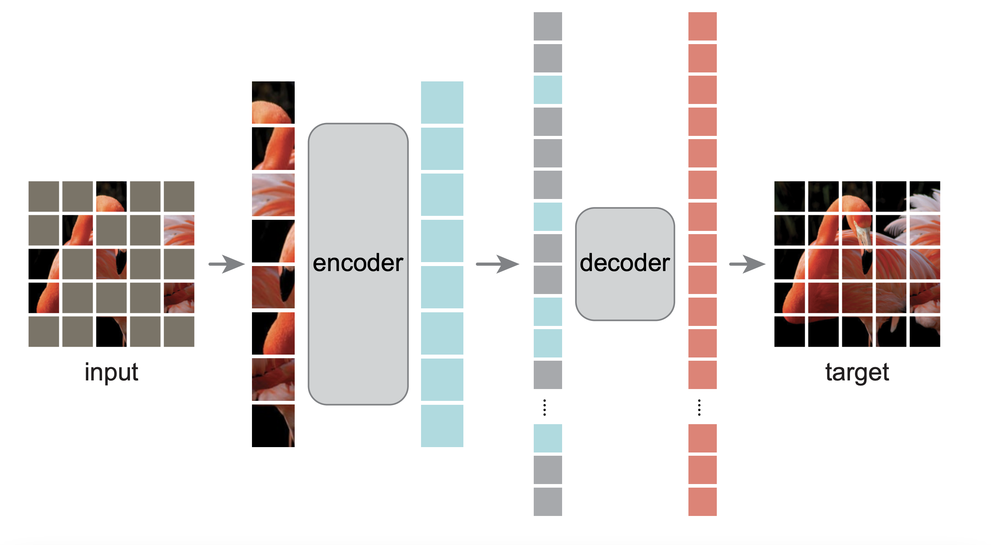
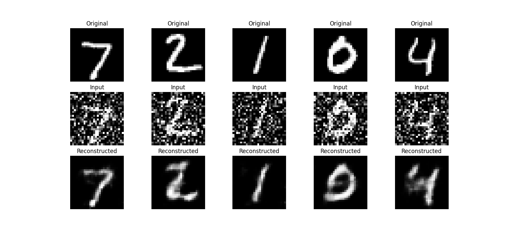
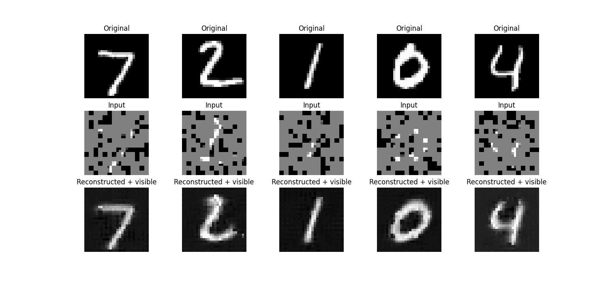
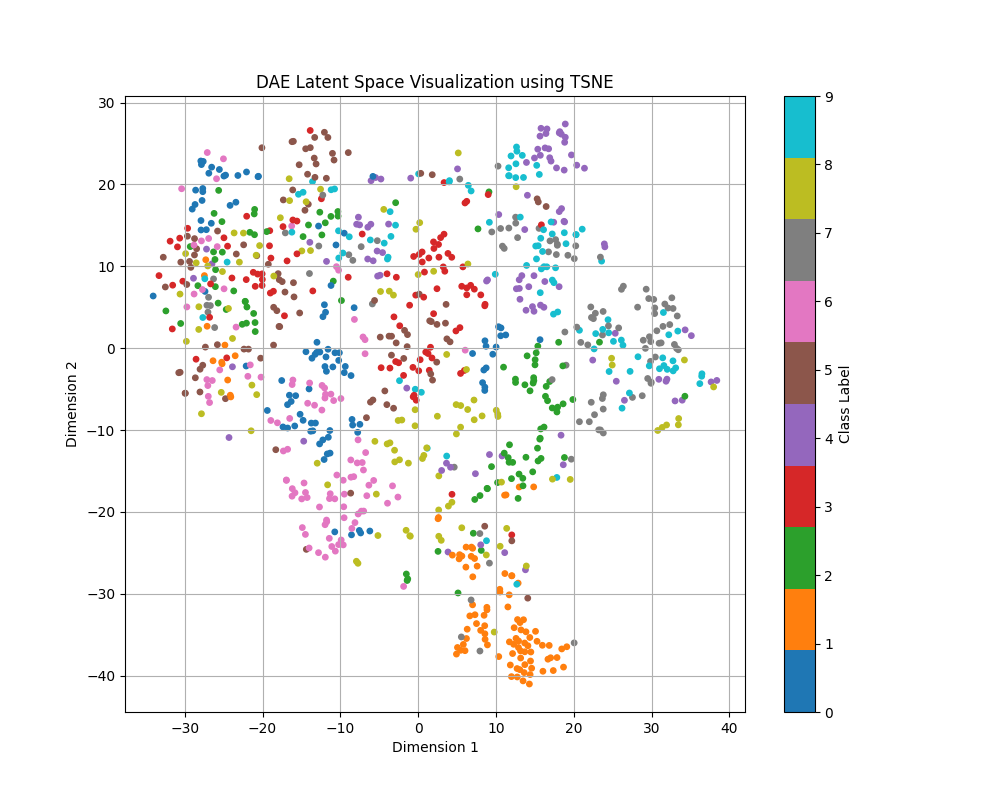
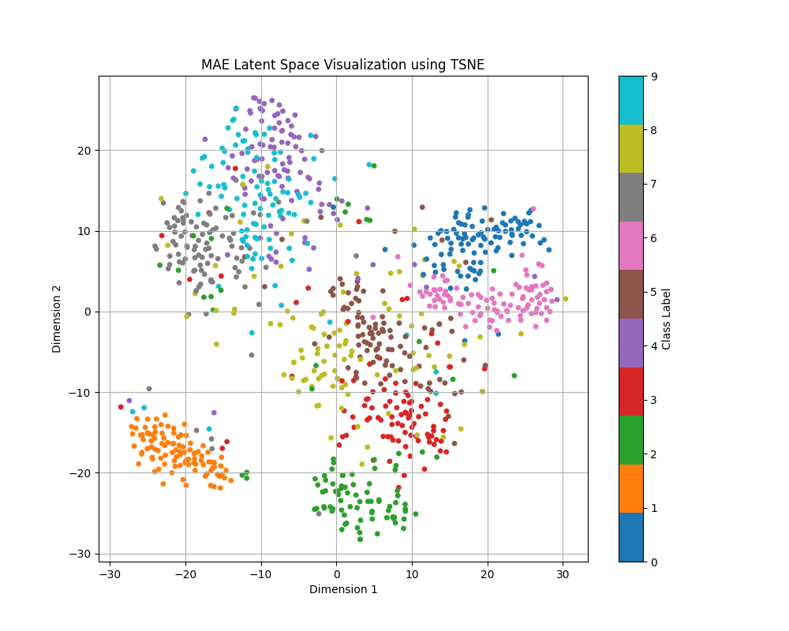
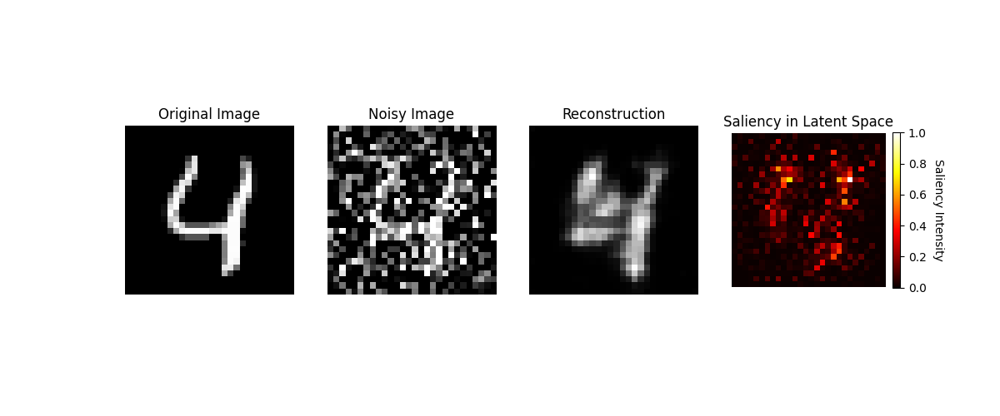
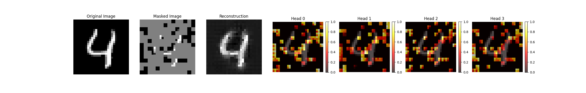

# Unmasking the Differences: Masked and Denoising Autoencoders in Image Representation

## Introduction and Motivation
Autoencoders are designed to learn efficient, compressed representations of input data, extracting their most prominent features to apply to downstream tasks like classification, clustering, and anomaly detection. Autoencoders for vision can be used for image denoising, image compression, image retrieval, and image generation. Applications can even include things like denoising MRI's for better image quality by removing artifacts. Input masking is a technique that increases the generalizability of these autoencoder latent representations, encouraging autoencoders to learn high-level features that better capture the essential patterns within the data and resulting in masked autoencoders (MAEs) that significantly outperform their regular counterparts ~\cite{MAEs}.

 Masked autoencoders learn complex reconstructions of the original images, suggesting that the architecture of the MAE has some hidden strengths that are yet to be understood. The original paper concluded with the remark "We hypothesize that this behavior occurs by way of a rich hidden representation inside the MAE. We hope this perspective will inspire future work." This study investigates how and why MAEs offer better feature representation through their latent space representations.

## What are Masked Autoencoders?

We focused on Kaiming He's original paper about masked autoencoders. Masked autoencoders (MAE's) are a form of denoising autoencoders that aim to reconstruct a full image given only random patches of the original image. 

The researchers were originally inspired by BERT, a language model that makes use of masked tokens. BERT will mask k% of the input sequence of words and predict the masked words. With the introduction of vision transformers, this sort of masked prediction model can be applied to images compared to just using convolution. 

A MAE will expect a series of image patches as the input. The encoder operates only on the visible (unmasked) patches of the image, and then the latent tokens plus the masked tokens are fed into the decoder for reconstruction. 

*Fig. x: Original MAE architecture from the MAE paper*

## Overview of Experiments

 Our group hypothesized that:
 1. MAE's probably have a latent space that is more meaningful than other denoising autoencoders (MAE). If definitive clusters can be seen in the latent space representations of our MAE's for inputs from the same image class, then we know that the MAE latent space representation contains semantic information about the actual input image. 
 2. Other denoising autoencoders (DAE's) probably have smaller weights. Smaller weights typically contribute less to the model’s output and we can assess the amount of useful information that our models are learning by examining their weight distributions. 

Therefore our experiments were as follows:
- To evaluate per-pixel accuracy, we’ll measure the peak signal-to-noise ratio (PSNR) of the images generated by the MAE and regular autoencoder. For structural accuracy, we’ll calculate the structural similarity index (SSIM) between the
reconstructed outputs and the original unmasked input images.
- We will create weight distribution histograms for the layers in both our DAE and our MAE, to analyze the magnitudes of weights contained in the images. 
- We will also visualize these with attention heatmaps where we visualize what parts of the image contribute the most to the attention mechanism. 
- We will also perform clustering on the latent space representations with the labeled class in mind. We anticipate that for images of the same label, their latent space representations will have a much tighter cluster for MAEs than for autoencoders. 

## Training MAE and DAE MNIST

Our group decided to start our project by training a DAE and MAE on MNIST data since it was small and easy to prototype with. 

### DAE Structure:
We found an existing DAE from [Udacity's Deep learning course](https://github.com/udacity/deep-learning-v2-pytorch/blob/master/autoencoder/denoising-autoencoder/Denoising_Autoencoder_Exercise.ipynb). It has a structure as follows:

The encoder has three convolutional layers with ReLU activations, each followed by max-pooling to reduce the spatial dimensions and extract features.
The channels evolve as follows:
Input image (1 channel) → 32 channels → 16 channels → 8 channels.

Each convolution uses a kernel size of 3×3, and padding ensures the dimensions remain consistent before pooling.

The noise is applied with torch.randn with a noise factor of 0.5.

### MAE Structure
For the MAE, we utilized the existing code written by the original researchers at Facebook Research Group, [published on Github](https://github.com/facebookresearch/mae). 

We made adjustments that included bugfixes and changing some modules so that they would return the attention maps and latent spaces of the model. 

#### Encoder Structure

The encoder processes only the visible (unmasked) patches.
It uses a Vision Transformer (ViT), which applies several layers of transformer blocks to extract high-level features.
A special "classification token" (cls_token) is added to summarize the global information across all patches.

#### Decoder
The decoder receives the latent representation from the encoder and reconstructs the image. It consists of masked tokens, positional embeddings, linear layers, and more transformers.

Masked tokens (representing the missing patches) are added back into the sequence to reconstruct the full set of patches.

Positional embeddings are used to inform the network about the spatial arrangement of patches.

The decoder uses another set of transformer blocks to predict the pixel values of the missing patches.

#### Training Details
The loss function for a MAE compares only the reconstructed (masked) patches against the original patches. Unlike the DAE, it does not compare the entire reconstructed image to the original image, which is why as the original paper notes, the reconstruction of the originally visible patches is noticeably worse as they are not included in the loss function. 

### Reconstruction images

*Fig x. DAE Reconstruction of noisy input images*

*Fig x. MAE Reconstruction of masked input images*

As we can see with Fig. x and Fig. x, The MAE generally reconstructs much better. The final loss for training the DAE was around 0.532, whereas the final loss for the MAE was only 0.11 for 20 epochs each. 

## Visualization of the Latent Space

Our hypothesis for why the MAE performs better was that the latent space contained more information that helped distinguish the image. In order to test this theory, we decided to visualize the latent space for both the DAE and the MAE.

We took the latent representations for the DAE and MAE and then visualized them using T-SNE reduction to gain the following graphs:

*Fig. X: Visualized the DAE Latent space using T-SNE dimensional reduction*

*Fig. X: Visualized the MAE Latent space using T-SNE dimensional reduction*

What's interesting about these images is we can see a cluster effect in the MAE latent space visualization. The latent spaces for images from the same classes are spaced much closer together for the MAE compared to the DAE. While they are not true separated clusters, there is definitely more grouping by class occurring for the MAE compared to the DAE. The radiuses of these latent space clusters were as follows:

| **Class** | **MAE Cluster Radius** | **DAE Cluster Radius** |
|-----------|-------------------------|-------------------------|
| 0         | 4.6971                 | 14.9228                |
| 1         | 3.6383                 | 12.1421                |
| 2         | 11.6399                | 21.0691                |
| 3         | 8.2036                 | 13.7999                |
| 4         | 7.8591                 | 17.9415                |
| 5         | 6.4910                 | 15.8864                |
| 6         | 5.3545                 | 12.4632                |
| 7         | 6.1213                 | 16.9559                |
| 8         | 10.2892                | 19.1732                |
| 9         | 7.7658                 | 16.4148                |

These radii were calculated by first finding the cluster center in the T-SNE reduced latent space. This is simply the average position (mean) of all the latent representations for that class. The radii is then just the average distance of each sample to its cluster center, to give us an idea of how spread out the radii are. We chose to do this for the reduced latent space as opposed to the true latent space because the MAE original latent space had a much higher dimensionality than the DAE latent space. 

These numbers and visualizations show that the MAE number classes in general had a much tighter cluster. These results suggest that the MAE outperforms the DAE in large part due to the latent space information. 

## Visualizing the Attention Maps

*Fig. x: DAE Saliency maps*

*Fig. x: MAE Attention heatmaps*

The DAE saliency map is computed by measuring how sensitive the latent representation of a denoising autoencoder (DAE) is to changes in each pixel of the input image. Gradients are calculated to find out how much each pixel of the input image contributes to the overall latent representation. This is done by "backtracking" from the latent space through the network to the input image. These gradient magnitudes are normalized to a 0–1 range and displayed as a heatmap, where brighter regions indicate pixels that have a greater impact on the latent space.

The MAE attention map is computed by taking the transformer block's attention maps matrix multiplied the attention matrix with the masked image and normalizing the resulting values for each block. After they were normalized, we overlayed the attention weights over the original image, and a brighter patch indicates the computed attention value was high for that patch. 

These maps demonstrate that the DAE has a lot more patches where the saliency is very low compared to the MAE. The MAE's attention is very high for all of the unmasked patches, indicating it learns more useful information about its inputs than the DAE. 

We also plotted the magnitudes of the weights for both the DAE and MAE's encoder + decoder:

## Conclusion

The results of our experiments show that MAE's generally outperform the DAE because of rich latent space information. The DAE also has more weights that are 0 compared to the MAE, meaning the MAE architecture is encapsulating more useful information. 